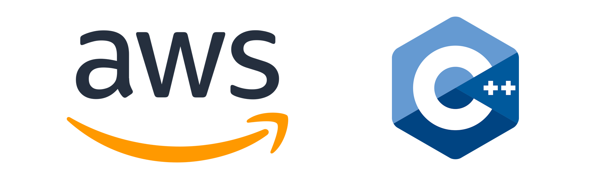

# Compiling and Linking to the AWS C++ SDK

Recently I was trying to work with the AWS C++ SDK. But I encountered problems with linking the .LIBs from the SDK to my project. Amazon provides instructions on compiling the SDK for various environments. I’m specifically am doing so on Windows with Visual Studio. The compilation process can take more than an hour. As I do with all such time-consuming developer setups, I’ve scripted the process. In this case, I’ve scripted the process as a batch file that is meant to be invoked from a Visual Studio 2022 developer prompt with administrative privileges. You can find a copy of the batch file [here][1]: 


# Compiling: An Easy Step, but a Long Wait

Should you try to run it yourself, there are 4 variables for paths that you may want to alter.

```
set CloneDrive=c:
set CloneFolder=%CloneDrive%\shares\projects\amazon
set InstallDrive=c:
set InstallFolder=%InstallDrive%\shares\projects\amazon\aws-cpp-sdk-lib
```

The version of this script that is checked in targets the C: drive. But on the actual machines I’m using, the drives where I have things are the B: drive and the D: drive. The AWS source code for the SDK will be cloned to the CloneFolder. It is then compiled, and the various DLLs, LIBs, and header files will be copied to subdirectories in the InstallFolder. Run the script, then find something else to do. This is going to take a while to run.


## The Difference between Static Linking and Dynamic Linking
Projects that use the Shared option also need for the dependent DLLs to be include. Those that use the Static have the functionality included in the same binary. With the Shared version of a project, you’ll need to make sure that you include all of the DLLs on which a project is dependent. If there is a bug fix to functionality in any of the DLLs, you could update only the affected DLLs. For the Static projects you don’t need to worry about ensuring that you’ve copied all of the dependent DLLs. The needed binary code is baked into your EXE. But if there is a bug fix for any of the AWS libraries, you need to redeploy your entire application.

## Even if Deploying with Static Linking, Debug with Dynamic Linking
Figuring out this information was a bit of a pain. I couldn’t locate documentation in the AWS C++ SDK that let me know which libraries had dependencies on which other libraries to know what to link to. With dynamic linking, if I miss a library on which there is a dependency, I get an error message stating what is missing. I find this useful and informative. It is more productive to debug with dynamic linking to get access to this information. The alternative, debugging with staticly linked libraries, results in earlier but less informative error messages at compile time. You’ll get a list of which functions and other objects are missing from the linked libraries. But those error messages do not let you know what LIB is needed to get these.

While Amazon provides information on how to only compile a few dependencies, saving compilation time by not compiling libraries you don’t need, I thought it better to compile everything possibly needed up front. While this can take more than an hour, since no attention is needed while the process is running, it takes very little of one’s own time. After compilation of the SDK, the folder c:\shares\projects\amazon\aws-cpp-sdk-lib has 4 folders. These folders contain the DLLs, LIBs, and headers for release and debug mode for static and dynamic linking.

## Hello AWS with Dynamic Linking
After running this script (and waiting an hour or more), this is where the real challenge begins! Let’s start with a minimalistic AWS C++ project. This is the complete source code. When this program is successfully run, it does about nothing. This is a program that exist not to do something, but to fail or succeed at compiling.

```
#include <iostream>
#include <aws/core/Aws.h>
 
#pragma comment(lib, "aws-cpp-sdk-core.lib")
 
int main()
{
    Aws::SDKOptions options;
    options.loggingOptions.logLevel = Aws::Utils::Logging::LogLevel::Info;
    Aws::InitAPI(options);
 
    Aws::ShutdownAPI(options);
}
```

If you make a new C++ Console project in Visual Studio and immediately try to compile this, it will fail. Some additional information is needed. Visual Studio needs to know from where to find the #include headers and the LIB referenced in the source code. Right-click on the project, select Properties, and change the following settings.

### C/C++ → General → Additional Include Directories

Click on the setting and select “Edit.” Click on the “New Folder” button and enter the path to the Include files. If you’ve left the default values in the script, this will be c:\shares\projects\amazon\aws-cpp-sdk-lib\DebugShared\include. I’m going to assume you are using default values from this point forward. If you are not, be sure to adjust any path that I state.

### Linker → General → Additional Library Directories

Click on the Edit button on this setting. In the window that opens, click on the New Folder button. Enter the path `c:\shares\projects\amazon\aws-cpp-sdk-lib\DebugShared\bin.`

Compile the program now. It should succeed at being compiled. However, if you run the program, it will likely fail. The program is unable to find the DLL that it needs to run. There are a couple ways to address this. You could change the system search path to include the folder where the DLLs are saved. But since release mode and debug mode use different DLLs, I don’t want to do this. Getting back errors on which specific DLLs are missing proved to be useful to me. For now I will copy the needed DLL, aws-cpp-sdk-core.dll, from the path c:\shares\projects\amazon\aws-cpp-sdk-lib\DebugShared\bin to the x64 output folder. Upon running again, you’ll find out that another dll is needed. Rather than let you discover all the DLLs that are needed, I’ll list them here.

* aws-c-auth.dll
* aws-c-cal.dll
* aws-c-common.dll
* aws-c-compression.dll
* aws-c-event-stream.dll
* aws-checksums.dll
* aws-c-http.dll
* aws-c-io.dll
* aws-c-mqtt.dll
* aws-cpp-sdk-core.dll
* aws-crt-cpp.dll
* aws-c-s3.dll
* aws-c-sdkutils.dll

If you copy those DLLs to the output folder and run the project, it will now run. In the above, the project is linking to the Shared (dynamic) version of the libraries. Let’s change it to use the Static.

## Hello AWS with Static Linking
Right-click on the project and open it’s properties again. Under Linker -> General -> Additional Include Directories, change the value that you entered to `c:\shares\projects\amazon\aws-cpp-sdk-lib\DebugStatic\lib`. Under C/C++ → General → Additional Include Directories, change the value entered to `B:\shares\projects\amazon\aws-cpp-sdk-lib\DebugStatic\include`.

Clean the project and recompile it. It is important that you clean the project. If you don’t, it could continue to run the old version (we haven’t actually changed the source code). When you compile the project now, you will get a lot of linker errors. To resolve these, there are several LIB files that you need to link to. I prefer to link to LIB files in source code. One could also do this through the project settings. The project settings method is preferrable when you want to have multiple build definitions. You could setup your project settings to debug using dynamic links to the DLLs and staticly link for release. If you want to link to the libs, right-click on the project, and select “Properties.” Go to Linker → Input → Additional Dependencies. In this setting you can place the name of the LIBs to which you want to link. Note that in the upper-left corner of the window is a drop-down for Configuration. Here, you could select whether the change you are making applies to the Release builds or Debug builds. Though it is beyond the scope of the discussion here, note that the “Configuration Manager” opens an interface where someone can make additional build variations.

Back to the source code. When we did a dynamically linked build, we got error messages about DLLs that needed to be available. For the static build, there are LIB files that correlate to each one of those DLLs. A line with #pragma comment(lib, "lib-name.lib") for each lib that we need to link to. If you make those lines for each of the DLLs that I listed above and compile again, there will be less unresolved external errors. You could work your way through the error list to discover each of the LIBs that is missing. Or, you could just take my word and copy from the following.

```
#pragma comment(lib, "aws-cpp-sdk-core.lib")
#pragma comment(lib, "aws-c-auth.lib")
#pragma comment(lib, "aws-c-cal.lib")
#pragma comment(lib, "aws-c-common.lib")
#pragma comment(lib, "aws-c-compression.lib")
#pragma comment(lib, "aws-c-event-stream.lib")
#pragma comment(lib, "aws-checksums.lib")
#pragma comment(lib, "aws-c-http.lib")
#pragma comment(lib, "aws-c-io.lib")
#pragma comment(lib, "aws-c-mqtt.lib")
#pragma comment(lib, "aws-cpp-sdk-core.lib")
#pragma comment(lib, "aws-crt-cpp.lib")
#pragma comment(lib, "aws-c-s3.lib")
#pragma comment(lib, "aws-c-sdkutils.lib")

#pragma comment(lib, "aws-c-s3.lib")
#pragma comment(lib, "aws-c-common.lib")
#pragma comment(lib, "aws-crt-cpp.lib")
#pragma comment(lib, "aws-cpp-sdk-s3.lib")
#pragma comment(lib, "aws-cpp-sdk-s3-encryption.lib")
#pragma comment(lib, "aws-cpp-sdk-s3-crt.lib")
#pragma comment(lib, "aws-cpp-sdk-transfer.lib")
```
With these added, you should now be able to compile and run the program.

## I Can Compile! Now What

There is an actual program that I want to share. But the process of compiling the SDK was involved enough (and takes long enough) such that I thought it was worthy of its own post. I have also found that there are some others that have struggled to compile the SDK and have encountered challenges in figuring out how to link. This post also serves to help them out. The next time I mention the AWS C++ SDK, it will likely be to show an application for storing information on various systems to S3.


* Mastodon: [@j2inet@masto.ai][2]
* Instagram:[@j2inet][3]
* YouTube: [@j2inet][4]
* Telegram: [j2inet][6]
* Bluesky: [@j2i.net][5]


[1]:https://github.com/j2inet/DevSetup/tree/main/aws-cpp
[2]:https://masto.ai/@j2inet
[3]:https://www.instagram.com/j2inet/
[4]:http://youtube.com/@j2inet
[5]:https://bsky.app/profile/j2i.net
[6]:http://telegram.me/j2inet
